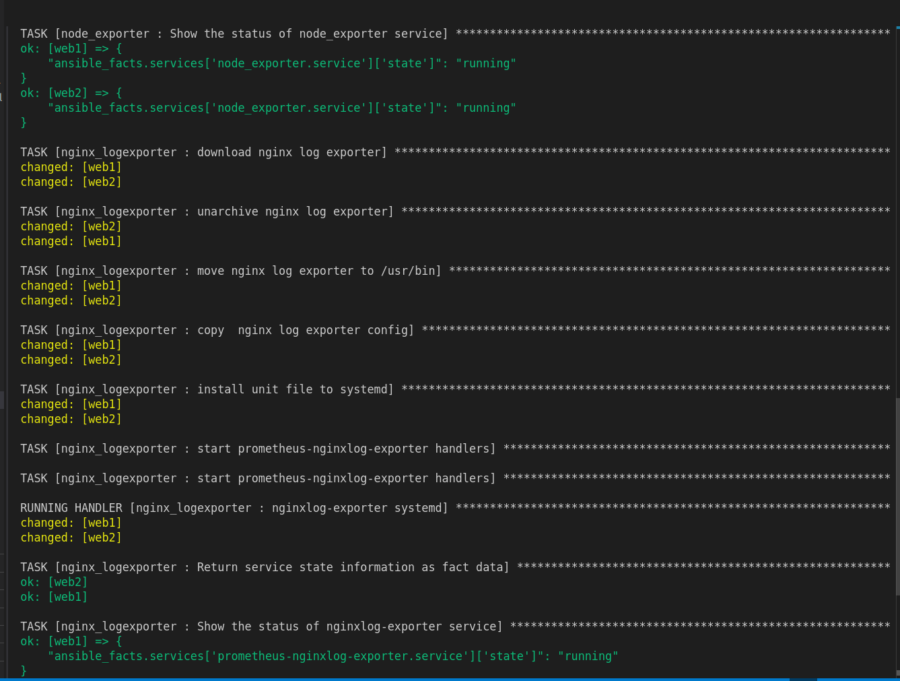
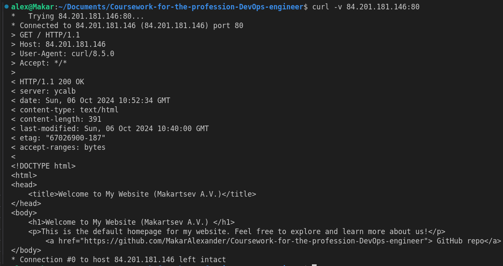
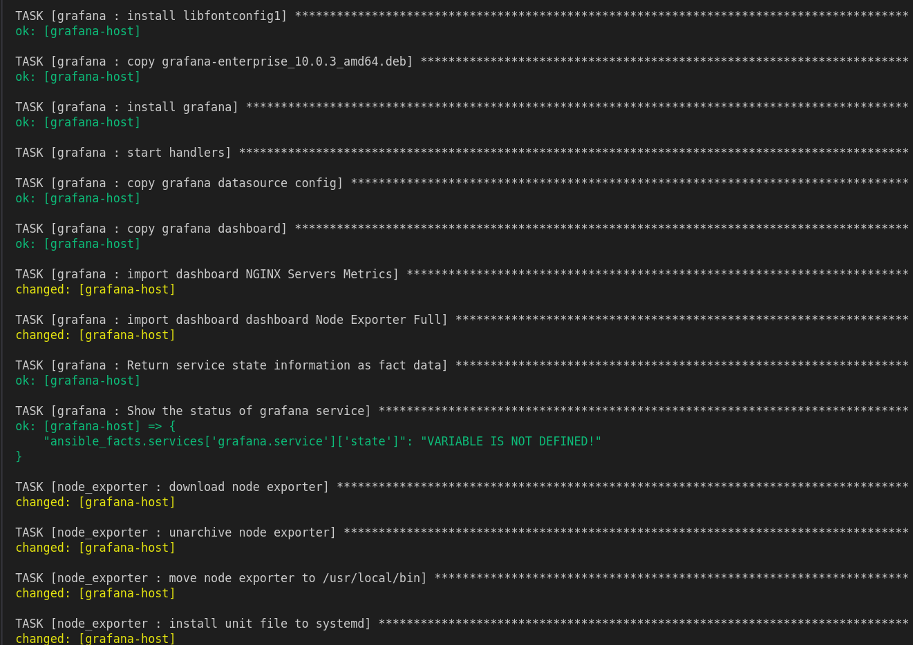

# Coursework-for-the-profession-DevOps-engineer "Макарцев Александр Владимирович"
Курсовая работа на профессии "DevOps-инженер с нуля"

Основная задача развернуть облачную инфраструктуру посредством Terraform и Ansible, в соответствии с [заданием](./Курсовой%20проект.md)

---

### Поднимаем инфраструктуру через Terraform:

- Инициализируем terraform

```sh
terraform init
```


- Разворачиваем инфрастуктуру через terraform

```sh
terraform apply
```


- Выводим output-ansible-hosts в отдельный файл hosts и удаляем всё лишнее

```sh
terraform output output-ansible-hosts > ../ansible/hosts
```

- Созданная инфраструктура в Yandex-cloud


Проверка доступности ВМ через ping

```sh
ansible all -m ping
```


---

### Сайт

>Target group:


>Backend group:


>HTTP router:


>Application load balancer:


[Запускаем playbook для верстки сайтов](./ansible/playbooks/webservers-playbook.yml)

>Обязательно нужно проверить, что сервисы nginx, node_exporter и nginx_logexporter работают

```sh
ansible-playbook main.yml -t webservers
```





Проверяем, что сайт работает

```sh
curl -v 84.201.181.146:80
```




---

### Мониторинг

[Поднятие мониторинга](./ansible/playbooks/monitoring-playbook.yml) (при первой прокатке может быть ошибка импортирования дашборда в Grafana, в этом случае требуется прокатить роль ещё раз)

```sh
ansible-playbook main.yml -t grafana
```





Проверяем, что импортированные дашборды работают корректно

>NGINX Servers Metrics:


>Node Exporter Full:


---

### Логи

[Поднятие системы логирования](./ansible/playbooks/log-playbook.yml) (обязательно нужно проверить, что контейнеры поднялись. Возможна ошибка при установке пакетов для docker, прокатываем роль ещё раз)

```sh
ansible-playbook main.yml -t elasticsearch
```


[Поднятие filebeat](./ansible/playbooks/log-filebeat-playbook.yml)

```sh
ansible-playbook main.yml -t filebeat
```


Проверяем Kibana на наличие логов из Nginx


---

### Сеть